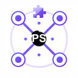

<div align="center">
  
</div>


# PubSub MFE DevTools Chrome Extension

Chrome DevTools extension for debugging applications using `@belyas/pubsub-mfe`.

## Features

- 🔍 Auto-detects active PubSub bus instances
- 📨 Real-time message feed
- 🌳 Subscription tree overview
- 📊 Live performance metrics (latency + throughput)
- ⚠️ Error capture for handler/validation diagnostics
- 🔌 Adapter activity status
- 🎯 Topic/source/adapter filtering
- 💾 Export captured data to JSON

## Build

From the repository root:

```bash
./build.sh
```

Build output is generated in:

- `dist`

## Enable DevTools integration in app code

```ts
import { createPubSub } from "@belyas/pubsub-mfe";

const bus = createPubSub({
  app: "my-app",
  enableDevTools: true,
  debug: true,
});
```

Recommended for production safety:

```ts
enableDevTools: process.env.NODE_ENV !== "production"
```

## Usage

1. Open your app page
2. Open Chrome DevTools
3. Select the **PubSub** tab
4. Pick a detected bus from the dropdown
5. Inspect messages, subscriptions, errors, adapters, and stats

## Architecture

```text
Page Context                    Extension Context
┌─────────────────────────┐     ┌────────────────────────────┐
│ PubSub bus + hooks      │     │ content-script.ts          │
│ injected-script.ts      │────▶│ chrome.runtime.sendMessage |
└─────────────┬───────────┘     └─────────────┬──────────────┘
              │                               │
              ▼                               ▼
      window.postMessage                  background.ts
                                              │
                                              ▼
                                          devtools.ts
                                              │
                                              ▼
                                          panel.ts UI
```

## Troubleshooting

### No bus detected

- Ensure `enableDevTools: true` is set when creating the bus
- Refresh page after loading/reloading the extension
- Confirm the DevTools panel is open on the inspected tab

### Events not appearing

- Check active filters (topic/source/adapter)
- Ensure panel is not paused
- Re-open the panel after extension reload

## Debugging tips

- **Panel UI**: right-click inside panel → Inspect
- **Background worker**: inspect extension service worker from `chrome://extensions`
- **Content / injected scripts**: inspect normal page DevTools console

## License

[Apache-2.0](./LICENSE) © Yassine Belkaid
